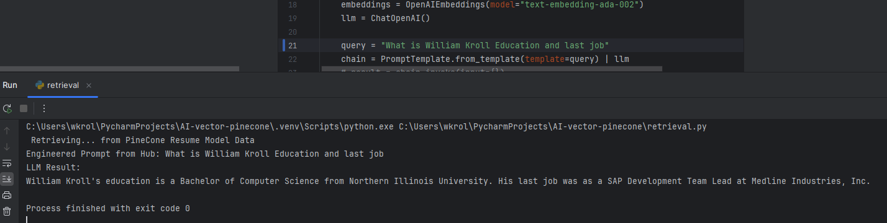
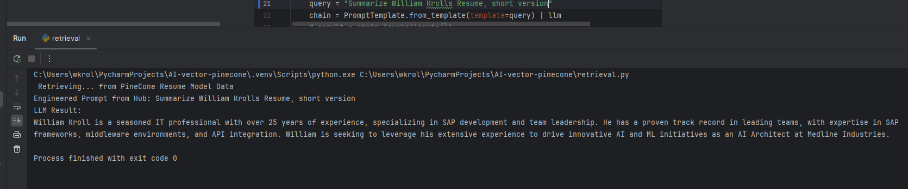
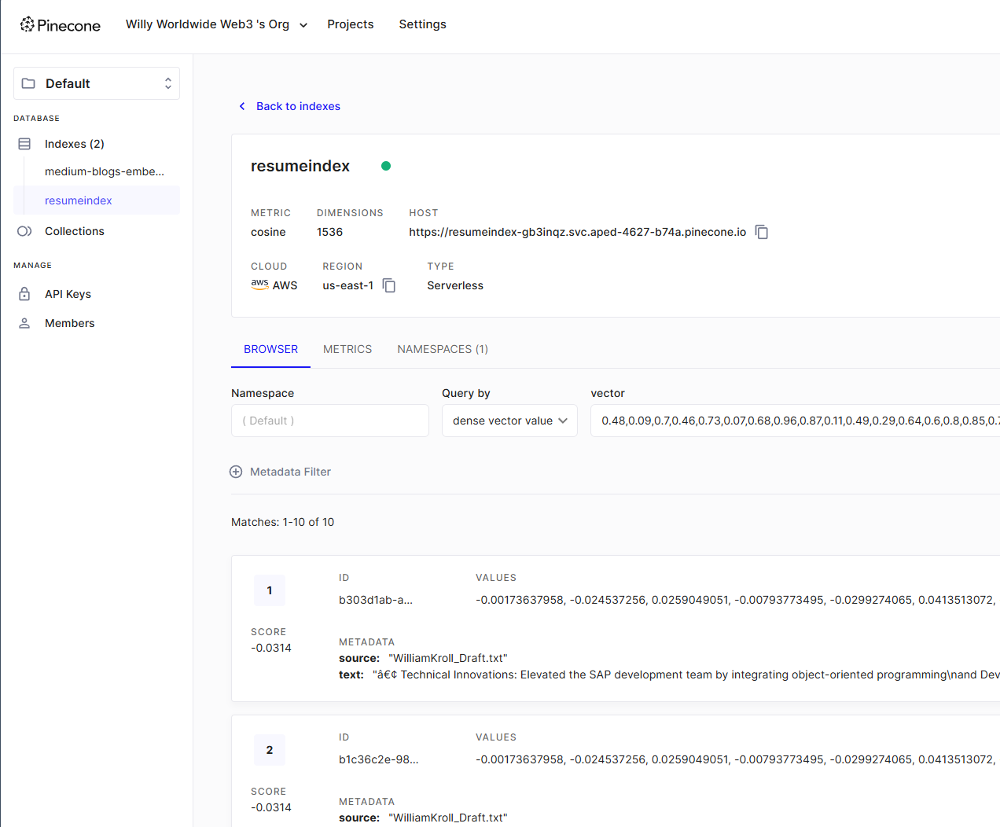
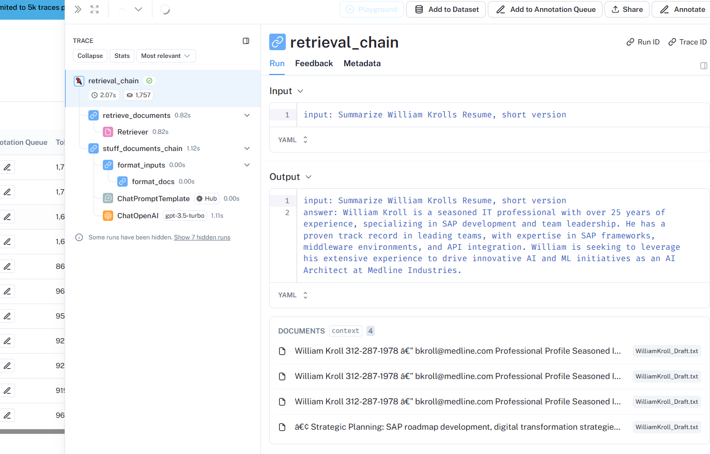

# Project README

## Overview

This project consists of two Python scripts that handle document ingestion, splitting, embedding storage using LangChain and Pinecone, and retrieval of embedded document information using a language model. The scripts work together to process documents, generate embeddings, store them, and retrieve information based on queries.

## Script 1: Document Ingestion and Embedding

### Description

This script loads a text document, splits it into manageable chunks, generates embeddings for each chunk using OpenAI's embedding model, and stores these embeddings in a Pinecone vector store.

### Code Details

1. **Environment Variables**: The script uses the `dotenv` library to load environment variables from a `.env` file.
2. **Document Loading**: It employs `TextLoader` to read the content of the text file  
3. **Text Splitting**: The document is split into chunks of 1000 characters using `CharacterTextSplitter`.
4. **Embedding Generation**: The script uses `OpenAIEmbeddings` to generate embeddings for each chunk of text.
5. **Storage**: The embeddings are stored in a Pinecone vector store specified by the environment variable `PINECONE_INDEX_NAME`.

### Workflow

- Load the environment variables.
- Load the document.
- Split the document into chunks.
- Generate embeddings for each chunk.
- Store the embeddings in the Pinecone vector store.
- Print the process details including the document content, chunks, and the number of chunks.

## Script 2: Document Retrieval and Query Processing

### Description

This script retrieves embedded document information from the Pinecone vector store using a query, processes the query using a language model, and outputs the relevant information.

### Code Details

1. **Environment Variables**: The script uses `dotenv` to load environment variables from a `.env` file.
2. **Embeddings and Language Model**: It initializes `OpenAIEmbeddings` and `ChatOpenAI` for generating embeddings and processing language queries.
3. **Query Definition**: A sample query, "What is Candiates  Education," is defined to retrieve specific information.
4. **Prompt Template**: The query is converted into a prompt template and processed using the language model.
5. **Vector Store Retrieval**: It connects to the Pinecone vector store using the environment variable `PINECONE_INDEX_NAME`.
6. **Document Retrieval Chain**: The script creates a retrieval chain to process the query, retrieve relevant documents, and combine the results using the language model.
7. **Output**: The result of the query is formatted and printed.

### Workflow

- Load the environment variables.
- Initialize the embeddings and language model.
- Define and process the query.
- Connect to the Pinecone vector store.
- Create a retrieval chain to handle the query.
- Retrieve the relevant information and print the formatted result.

### Sample Output

The script prints the engineered prompt and the formatted result of the query, displaying the relevant information retrieved from the embedded documents.

---Python Terminal First prompt example

---Python Terminal Second prompt Examle

--This is PineCone Ingestion of  Resume

--This is Langchain Monitoring debug tool

 
